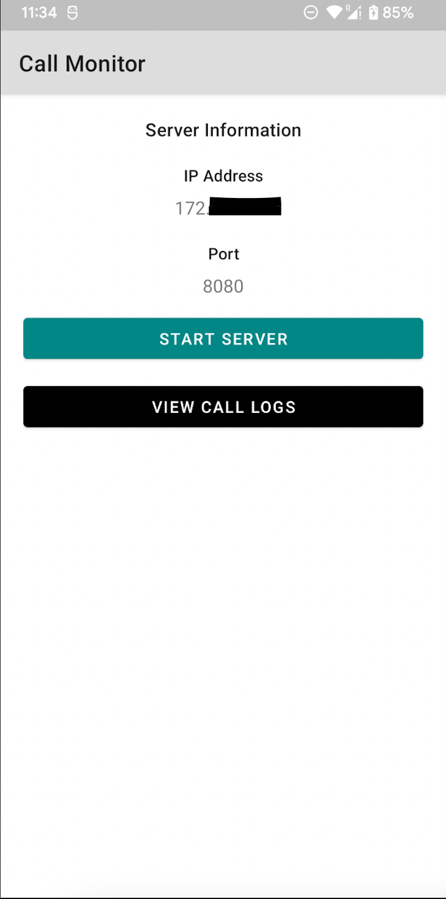
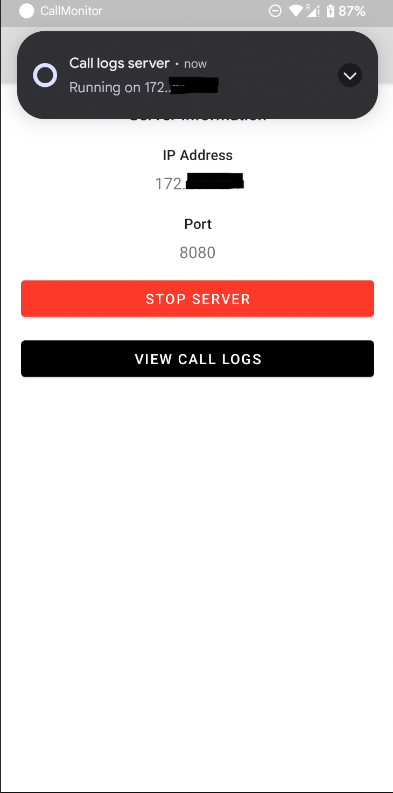
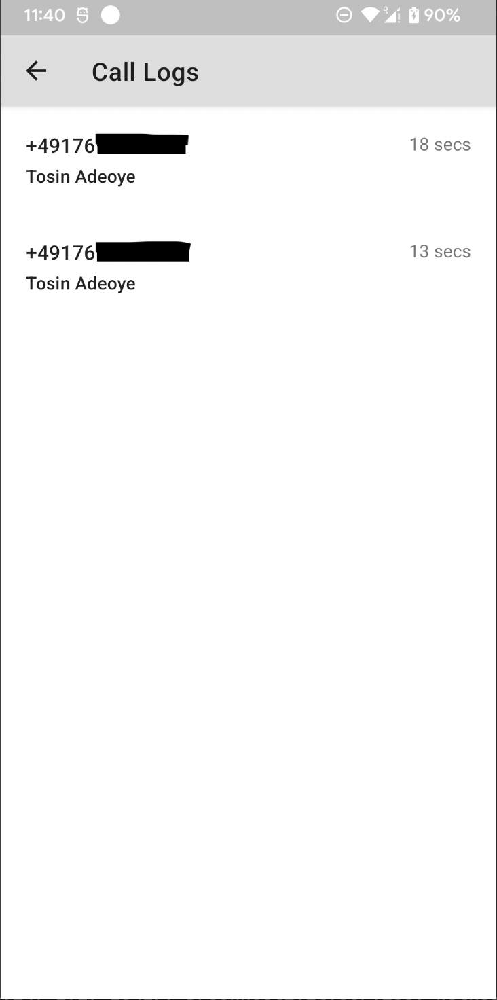

# Call Monitor
An android app that monitor your calls, saves the caller phone number and the name and exposes an api server to query the call logs. Calls are logged only while the server is running.

## API
| Name  | Description | Path | Verb | Response | Failure |
| ------------- | ------------- | ------------- | ------------- | -------------| -------------|
| API overview  | Lists all the available endpoints  | `/`  |  GET  |  200 - `{"startTime": "Sun Oct 16 14:43:47 PDT 2022", "services": [{"name": "status","uri": "http://192.168.1.100:12345/status"}, {"uri":"http://192.168.1.100:12345/status"}]}` | 400 -  `{"message": "Something went wrong"}`  |
| Status  | Returns whether there is an ongoing call alongside the phone number and caller's name | `/status`  |  GET  |  200 - `{"hasOngoingCall": true or false,"phoneNumber": "014889389892" or null,"callerName": "John Doe" or null}` | 400 -  `{"message": "Something went wrong"}`  |
| Log  | Returns the list of logged calls from the time the server is started | `/log`  |  GET  |  200 - `[{"startTime": "Sun Oct 16 14:43:47 PDT 2022","durationInSeconds": 20,"phoneNumber": "014889389892","callerName": "John Doe","timesQueried": 1}` | 400 -  `{"message": "Something went wrong"}`  |

## Screenshots
  
